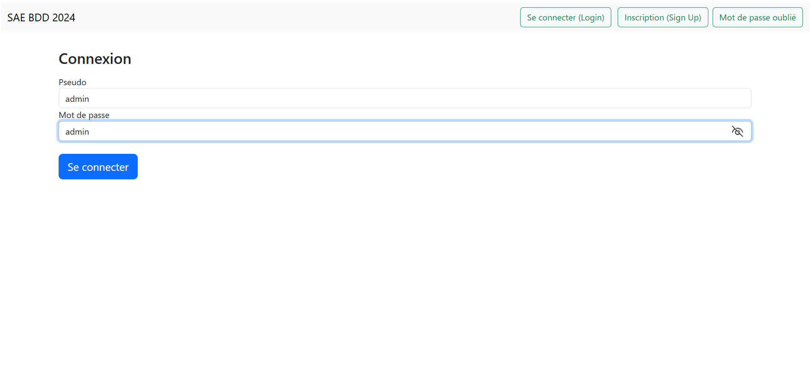

# Équipe Team Chartreuse - Projet BUT Informatique Eclat D'Etoile - 08/02/2024 07/05/2024


## Informations Équipe
- **Membres** :
  - Baptiste DULIEUX
  - Marvyn LEVIN (référent)
  - Timothée MEYER
  - Cédric COLIN
- **Objectif** : Développer **Eclat D'Étoile**, une plateforme de gestion des peintures permettant aux clients de parcourir, filtrer et acheter des produits en ligne tout en gérant efficacement les commandes et les stocks.

## Documents liés au projet
- [-pdf](./docs/)
- [](./docs/)
- [-pdf](./docs/)
- [-pdf](./docs/)

## Cahier des Charges

### 1. Présentation du Projet
- **But** : 
- **Moyens** : 
- **Objectifs du système** :
  - **Gestion de flotte** : 
  - **Suivi des réservoirs d'hydrogène** : 
  - **Performances et consommation** : 

### 2. Types de Fichiers
- **Modèle Conceptuel de Données (MCD)** : Réalisé avec un outil graphique dédié [looping](https://www.looping-mcd.fr/) et disponible au format `.loo`.

### 3. Recherche Documentaire
- **Ressources** :
  - [Réalisation MCD](./docs/TD1introMCD.pdf)
  - [De MCD à MLD](./docs/TD2MCDtoMR.pdf)
  - [Introduction au SQL](./docs/S2_Mysql_tp2_v23_correction_etu.pdf)

### 4. Répartition du Travail
- **Baptiste DULIEUX** :
  - Analyse des besoins, conception du MCD, gestion des 
- **Marvyn LEVIN** :
  - Analyse des besoins, conception du MCD, gestion des 
- **Timothée MEYER** :
  - Analyse des besoins, conception du MCD, gestion des 
- **Cédric COLIN** :
  - Analyse des besoins, conception du MCD, gestion des 

## Concept de Modélisation

### Structure et Associations
- **Modèle Conceptuel de Données (MCD)** : 
  Le MCD structuré pour gérer la flotte de peintures comprend plusieurs entités et leurs associations :
  
  - **Entités principales** :
    - **Couleur** : Représente les différentes couleurs de peinture disponibles.
    - **Utilisateur** : Gère les informations des utilisateurs du système, comme les clients et les administrateurs.
    - **Peinture** : Contient des détails sur chaque type de peinture, y compris son nom, son volume et son prix.
    - **Commande** : Représente une commande passée par un utilisateur, y compris la date d'achat et l'état de la commande.
    - **Déclinaison de Peinture** : Détaille les variations de chaque peinture en termes de taille et de couleur.

  - **Associations** :
    - **Utilisateur à Commande** : Un utilisateur peut passer plusieurs commandes, mais chaque commande appartient à un seul utilisateur.
    - **Peinture à Déclinaison de Peinture** : Une peinture peut avoir plusieurs déclinaisons (tailles et couleurs).
    - **Commande à Ligne de Commande** : Une commande peut contenir plusieurs lignes de commande, chacune représentant un article spécifique.


- **Modèle Logique de Données (MLD)** : 
  Le MLD traduit les entités et associations du MCD en tables pour une base de données relationnelle :

- **Tables principales** :
  - **Couleur** :
    - `id_couleur` (PK), `nom_couleur`, `code_couleur`.
  - **Utilisateur** :
    - `id_utilisateur` (PK), `login`, `email`, `nom`, `password`, `role`.
  - **Peinture** :
    - `id_peinture` (PK), `nom_peinture`, `volume_pot`, `prix_peinture`, `couleur_id` (FK), `id_type_peinture` (FK).
  - **Commande** :
    - `id_commande` (PK), `date_achat`, `id_utilisateur` (FK), `id_etat` (FK).
  - **Déclinaison de Peinture** :
    - `id_declinaison_peinture` (PK), `stock`, `prix_declinaison`, `id_peinture` (FK), `id_couleur` (FK), `id_taille` (FK).
  - **Ligne de Commande** :
    - `id_commande` (PK, FK), `id_declinaison_peinture` (PK, FK), `quantite`, `prix`.

- **Intégrité Référentielle** : 
  Les clés primaires et étrangères assurent la cohérence des relations entre les tables. Par exemple, chaque `id_utilisateur` dans la table `Commande` doit correspondre à un `id_utilisateur` existant dans la table `Utilisateur`. Cela garantit que les commandes ne peuvent être passées que par des utilisateurs enregistrés.


### Inspiration et Conception Visuelle
L'interface utilisateur présentée permet aux utilisateurs de naviguer et d'acheter des articles de peinture de manière efficace. Voici les points clés :

1. **Affichage des Articles** : Les peintures sont affichées sous forme de cartes avec le nom, le prix et une image, accompagnées d'un bouton pour ajouter des quantités au panier.

2. **Filtrage** : Les utilisateurs peuvent filtrer les articles par prix en entrant des valeurs minimales et maximales.

3. **Détails des Articles** : En cliquant sur un article, les utilisateurs accèdent à des informations détaillées, incluant la note moyenne, la possibilité de modifier ou de supprimer leur note, et une section pour ajouter des commentaires.

4. **Interactions Utilisateur** : Les clients peuvent noter les articles et laisser des avis, ce qui aide les autres acheteurs dans leur prise de décision.

5. **Esthétique** : L'interface est claire et bien organisée, offrant une expérience utilisateur agréable.


## Instructions d'Exécution sur Windows

### Étapes d'Installation

1. **Installation de MariaDB :**  
   Téléchargez et installez MariaDB depuis le site officiel : [MariaDB Download](https://mariadb.org/download/).
2. **Installation de Python :**
   Téléchargez et installez Python 3.13.3 depuis le site officiel : [Python Download](https://www.python.org/ftp/python/3.13.0/python-3.13.0-amd64.exe)

### Configuration de la Base de Données

Ouvrez une nouvelle fenêtre MariaDB 11.5 (x64) et exécutez les commandes suivantes :
```shell
# Se connecter avec l'utilisateur root
mysql -u root -p

# Créer un utilisateur
CREATE USER 'identifiant'@'localhost' IDENTIFIED BY 'votre_mot_de_passe';
GRANT ALL PRIVILEGES ON *.* TO 'identifiant'@'localhost' WITH GRANT OPTION;
FLUSH PRIVILEGES;

# Se connecter avec l'utilisateur identifiant
mysql -u identifiant -p

# Créer la base de données
CREATE DATABASE peinture;
USE peinture;
SHOW DATABASES;
```

### Exécution des Scripts SQL


- Exécutez les scripts SQL fournis dans le fichier `sae_sql.sql` pour créer les tables et charger les données initiales.

### Lancement de l'API

Ouvrez une nouvelle fenêtre PowerShell et exécutez les commandes suivantes :
```shell
cd \Desktop\eclatdetoile

# Vérifier si python est existant
python --version

# Installer pip
pip install --upgrade pip 

# Installer Flask et PyMySQL
pip install flask
pip install pymysql
pip install python-dotenv

# Créer le fichier de configuration de la base de données
Set-Content -Path ".env" -Value @"
HOST=localhost
LOGIN=ton_nom_d_utilisateur
PASSWD=ton_mot_de_passe
DATABASE=nom_de_ta_base
PORT=port_3306_defaut
"@

# Vérifier le contenu du fichier db.py
Get-Content -Path ".env"

# Lancer l'application Flask
python -m flask run
```

### API Lancée
Lorsque l’API Flask est lancée, vous devriez voir le message suivant :

```shell
 * Debug mode: off
WARNING: This is a development server. Do not use it in a production deployment. Use a production WSGI server instead.
 * Running on http://127.0.0.1:5000
Press CTRL+C to quit
```

Pour vous connecter, il faut taper `admin`, `client`, `client2` en `identifiant` et la même chose en `mot de passe` :
